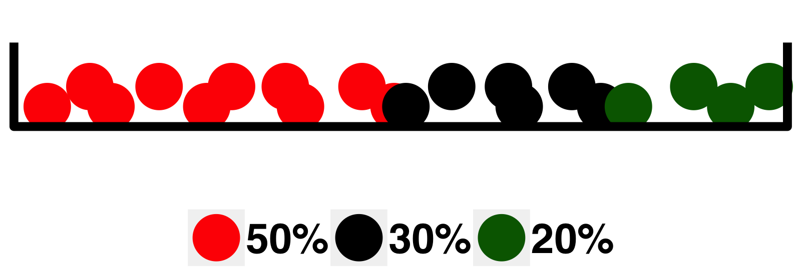

```{r,setup, include=FALSE}
knitr::opts_chunk$set(cache=TRUE, message = FALSE)
options(knitr.table.format = "latex")

library(tidyverse)
library(kableExtra)
```

[**Download pdf**](basics-of-probabilities.pdf)

## Definitions: _Sample Space_, _Events_

### Random experiment 

_By the term **random experiment** we assume any process, which outcome is unknown in advance_.

### Sample space 

_A collection of all possible outcomes_ ($\Omega$).

### Sample point 

_An element_ $\omega \in \Omega$.

### Event 

_A subset $A$ of sample points, $A \subset \Omega$, for which a statement about an outcome is true_.

**Example** (Rolling a die)

```{r  out.width = "50%", fig.align='center'}
# 
library(tidydice)
dice <- roll_dice(times = 6) 
dice$result <- seq(1, 6)
plot_dice(dice)
```

- _**Random experiment**_: _rolling a six-sided die_.
- _**Sample space**_: $\Omega = \{1, 2, 3, 4, 5, 6\}$.
- _**Events**_:
  + $A = \text{"a number is even"} = \{2, 4, 6\}$.
  + $B = \text{"a number is divisible by 3"} = \{3, 6\}$.
  + $C = \text{"a number is larger than 2"} = \{3, 4, 5, 6\}$.


## Operations with events

### Sum of events

An event  $A + B$ (or $A \cup B$) is called a _**sum of two events**_, and it means that _either $A$ or $B$, or both are true_.

### Product of events.

An event $A \cdot B$ (or $A \cap B$) is called a _**product of two events**_, and it means that _both $A$ and $B$ are true simultaneously_.

### Mutually exclusive events.

Two events $A$ and $B$ are _**Mutually exclusive**_ if they cannot be true simultaneously, and $A \cdot B = \emptyset$ (impossible event).

### Complement

An event $A^c$ is called a _**complement**_ of an event $A$ (or an _**opposite event**_):

- $A + A^c = \Omega$ (sample space)
- $A \cdot A^c = \mathcal{\emptyset}$ (impossible event)


## Probabilities

_**Probabilities** are numbers assigned to the events and express the chances of events' occurrences_.


1. $\text{P}\left(\emptyset\right) = 0$.
2. $\text{P}\left(\Omega\right) = 1$.
3. For any event $A$, $0 \leq \text{P}\left(A\right) \leq 1$.


### Classical definition

_Probability of an event $A$ is defined as_
$$
  \text{P}\left(A\right) = \frac{\text{number of sample that belong to the event }A}{\text{total number of sample points in the sample space }\Omega} = \frac{N_A}{N_\Omega}.
$$
_**Remark**_. The probability defined by the formula above is a proper approach in the situations when each sample point from a sample space has equal chance to occur.


**Example** (Classical definition of probability)

```{r  out.width = "50%", fig.align='center'}
# 
library(tidydice)
dice <- roll_dice(times = 6) 
dice$result <- seq(1, 6)
plot_dice(dice)
```

- _**Sample space**_: $\Omega= \{1, 2, 3, 4, 5, 6\}$.
- _**Events**_:
  + $A = \text{"a number is even"} = \{2, 4, 6\} \Rightarrow$
  $$\text{P}\left(A\right) = \frac{3}{6} = \frac{1}{2}.$$
  + $B = \text{"a number is divisible by 3"} = \{3, 6\} \Rightarrow$
  $$\text{P}\left(B\right) = \frac{2}{6} = \frac{1}{3}.$$
  + $C = \text{"a number is larger than 2"} = \{3, 4, 5, 6\}  \Rightarrow$
  $$\text{P}\left(C\right) = \frac{4}{6} = \frac{2}{3}.$$


## Rules for probabilities

1. For any two events $A$ and $B$,
$$\text{P}\left(A + B\right) = \text{P}\left(A\right) + \text{P}\left(B\right) - \text{P}\left(A\cdot B\right).$$
2. Let $A_1, A_2, \ldots$ be an infinite sequence of _**mutually excluding**_ (i.e. $A_i\cdot A_j = \emptyset$, if. $i\ne j$) events. Then
$$\text{P}\left(\text{"At least one of }A_i \text{ is true"}\right) = \text{P}\left(\sum_{i = 1}^\infty A_i\right) = \sum\limits_{i = 1}^\infty{\text{P}\left(A_i\right)}.$$
3. Conditional probability
$$\text{P}\left(A|B\right) = \frac{\text{P}\left(A\cdot B\right)}{\text{P}\left(B\right)},$$
the probability that $A$ is true when we _**know**_ that some event $B$ is true.

### Independence of events

_Two events $A, B \subset \Omega$ are called **independent** if_ 
$$\text{P}\left(A\cdot B\right) = \text{P}\left(A\right)\cdot\text{P}\left(B\right).$$

_Two events $A$ and $B$ are **dependent** if they are not independent, i.e._
$$\text{P}\left(A\cdot B\right) \ne \text{P}\left(A\right)\cdot\text{P}\left(B\right).$$

For two _**dependent**_ events $A$ and $B$,
$$\text{P}\left(A\cdot B\right) = \text{P}\left(A\right)\cdot\text{P}\left(B|A\right) = \text{P}\left(B\right)\cdot\text{P}\left(A|B\right).$$

## Law of total probability

### Partition of sample Space

_A collection of events $A_1, A_2, \ldots, A_n$ is called a **partition** of a sample space $\Omega$ if_

(i) _The events are mutually excluding, i.e._ $$A_i\cdot A_j = \emptyset, \text{ }i\ne j.$$
(ii) _The collection is exhausive, i.e._ $$A_1+ A_2 +\ldots+ A_n = \Omega,$$
_that is, at least one of the events $A_i$ occurs_.


### Law of total probability

_Let $A_1, A_2, \ldots, A_n$ be a partition of a sample space $\Omega$. Then, for any event $B$_,

$$
  \text{P}\left(B\right)=\text{P}\left(B|A_1\right)\text{P}\left(A_1\right)+\text{P}\left(B|A_2\right)\text{P}\left(A_2\right)+\ldots+\text{P}\left(B|A_n\right)\text{P}\left(A_n\right).
$$

**Example** (Law of total probability)

- An event $B$ is "Experiencing an adverse event (AE) for a patient in the comparative clinical trial with two experimental ($E_1$, $E_2$) and one control ($C$) treatment."
- From the previous studies, it is known that 
    - 1 out of 50 patients experienced AE on treatment $E_1$.
    - 1 out of 25 patients experienced AE on tretament $E_2$.
    - 1 out of 10 patients experienced AE on tretament $C$.
- Patients are randomzied to treatments with probabilities
$$p_{E_1} = 0.5, \text{ }p_{E_2} = 0.3 \text{ }p_{C} = 0.2.$$

_**Q**_: _What is the probability of AE for a random patient?_

**Solution**:

- Let us consider the followinf partition of a sample space:
    - $A_1$ = "A patient is randomzied to treatment $E_1$".
    - $A_2$ = "A patient is randomzied to treatment $E_2$".
    - $A_3$ = "A patient is randomzied to treatment $C$".
- $A_1, A_2, A_3$ are mutually excluding but at least one of them is true.
- Then we can define:
$$
\begin{array}{ll}
  \text{P}\left(B|A_1\right) = \frac{1}{50} = 0.02 & \text{P}\left(A_1\right) = p_{E_1} = 0.5 \\
  \text{P}\left(B|A_2\right) = \frac{1}{25} = 0.04 & \text{P}\left(A_2\right) = p_{E_2} = 0.3 \\
  \text{P}\left(B|A_3\right) = \frac{1}{10} = 0.10 & \text{P}\left(A_3\right) = p_{C} = 0.2
\end{array}
$$

$$
  P(B) = 0.02\cdot 0.5 + 0.04\cdot 0.3 + 0.10\cdot 0.2 = `r sum(c(0.02, 0.04, 0.10)*c(0.5, 0.3, 0.2))`.
$$

## Bayes' formula

### Bayes' theorem

Let $A_1, \ldots, A_n$ be a partition of a sample space $\Omega$, and $B$ is an event with $\text{P}\left(B\right) > 0$.

\begin{itemize}
  \item $\text{P}\left(A_i\right)$, $i = 1, \ldots, n$, is a \textbf{prior probability}.
  \item $L(A_i) = \text{P}\left(B|A_i\right)$, $i = 1, \ldots, n$, is a \textbf{likelihood} (measures how likely the observed event $B$ under the alternative $A_i$).
\end{itemize}

Then a **posterior probability**

$$
  \text{P}\left(A_i|B\right)=\frac{\text{P}(A_i\cap B)}{\text{P}(B)}=\frac{\text{P}(A_i)\text{P}(B|A_i)}{\text{P}(B)}.
$$
**Name due to** _Thomas Bayes_ (1702-1762)


### Bayes' formula

Recall that, due to the law of total probability, 

$$
\text{P}(B) = \text{P}(B|A_1)\text{P}(A_1) + \ldots + \text{P}(B|A_n)\text{P}(A_n).
$$

Then, the Bayes' formula can be rewritten as 

$$
  \text{P}\left(A_i|B\right)=c\text{P}(A_i)\text{P}(B|A_i)\text{}\left(c = \frac{1}{\text{P}(B)}\right).
$$

In practical computations, all terms $\text{P}(A_i)\text{P}(B|A_i)$, $i = 1, \ldots, n$, are evauated, then $c$ is derived.


## Odds and subjective probabilities

```{r  out.width = "20%", fig.align='center'}
 
```

Two events associated with the experiment "tossing a coin":

- $A_1 = \text{"A coin shows a "head""}$
- $A_2 = \text{"A coin shows a "tail""}$

If a coin is _**fair**_ than the _**odds**_ for $A_1$ and $A_2$ is $1:1$.

In the more general case, the _**odds**_ for two events $A_1$ and $A_2$ are defined as any posisitve numbers $q_1, q_2$ such that 

$$
  \frac{q_1}{q_2} = \frac{\text{P}(A_1)}{\text{P}(A_2)}.
$$

- Probabilities _**are known**_ $\Rightarrow$ odds _**can always be found**_.
- Odds are known $\not \Rightarrow$ probabilities _**can always be found**_. 
(a {width=7%} example with just two outcomes considered)

Let $A_1, A_2, \ldots, A_n$ be a partition of $\Omega$, having odds $q_i$, i.e. for any $i, j$, $\frac{\text{P}(A_j)}{\text{P}(A_i)} = \frac{q_j}{q_i}$. Then

$$
  \text{P}(A_i) = \frac{q_i}{q_1 + q_2 + \ldots + q_n}, \text{ }i = 1, 2, \ldots, n.
$$


**Example** (Odds)

```{r  out.width = "70%", fig.align='center'}
 
```

- An experiment is to draw a ball from the urn.
    - $A_1 = \text{"a ball is red"}$
    - $A_2 = \text{"a ball is black"}$
    - $A_3 = \text{"a ball is green"}$
- $A_1, A_2, A_3$ forms a partition.
- Odds: $q_1:q_2:q_3 = 5:3:2$.
    - $\text{P}(A_1) = \frac{5}{5+3+2} = 0.5$, $\text{P}(A_2) = 0.3$, $\text{P}(A_3) = 0.2$.
    

## Bayes' formula for odds

- Let $A_1, A_2, \ldots, A_n$ be a partition of $\Omega$ with the _a priori_ odds $q^\text{prior}_1, q^\text{prior}_2, \ldots, q^\text{prior}_n$.
- The _a posteriory_ odds are any positive numbers $q^\text{post}_1, q^\text{post}_2, \ldots, q^\text{post}_n$ such that
$$
  \frac{\text{P}(A_i|B)}{\text{P}(A_j|B)} = \frac{q^\text{post}_i}{q^\text{post}_j}.
$$

- By applying Bayes'formula, we have
$$
  \frac{q^\text{post}_i}{q^\text{post}_j} = \frac{\text{P}(A_i|B)}{\text{P}(A_j|B)} = 
  \frac{\text{P}(B|A_i)\text{P}(A_i)}{\text{P}(B)}\cdot\frac{1}{\frac{\text{P}(B|A_j)\text{P}(A_j)}{\text{P}(B)}} = \frac{\text{P}(B|A_i)}{\text{P}(B|A_j)}\cdot\frac{q^\text{prior}_i}{q^\text{prior}_j}
$$
which implies that 
$$
  q^\text{post}_i = c\text{P}(B|A_i)q^\text{prior}_i, \text{ }i = 1, 2, \ldots, n,
$$
where $c$ is any positive number.


**Example** (Bayes' formula for odds)

A newspaper reports that the first case of a susbected "mad cow"\footnote{BSE (Bovine Spongiform Encephalopathy) infected cow} is found. "Suspected" means that a laboratory test for the illness gave positive result. 

Since this information can influence shopping habbits, a preliminary risk analysis is desired. 

The most important information is the probability that a cow, _positively tested for BSE_, is _**really infected**_.


**Mathematical formulation of the problem**:

- $A = \text{"A cow is BSE infected"}$
- A partition:
    + $A_1 = A = \text{"A cow is BSE infected"}$
    + $A_2 = A^c = \text{"A cow is NOT BSE infected"}$
- $B = \text{"A cow is positively tested for BSE"}$

The _posterior_ odds, $q_1^\text{post}, q_2 ^\text{post}$, for $A_1$ and $A_2$ can be computed using Bayes' formula for odds, if _prior_ odds, $q_1^\text{prior}, q_2^\text{prior}$, and the conditional probabilities $\text{P}(B|A_1)$ and $\text{P}(B|A_2)$ are known:

$$
  q_i^\text{post} = \text{P}(B|A_i)q_i^\text{prior}, \text{ }i = 1, 2.
$$


### Selection of prior odds

Assume that the following information is available (say from the previous experience, or from the _Internet_):

- The frequency of infected cows that pass the test, i.e. are _**not detected**_, is 1 per 100 $\Rightarrow P(B|A_1) = 0.99.$

- A healthy cow is suspected for having BSE in 1 per 1000 cases $\Rightarrow P(B|A_2) = 0.001.$
- $q_1^\text{prior}:q_2^\text{prior} = 1:1$.

Then, $q_1^\text{post} = 0.99\cdot 1 = 0.99, \text{ }q_2^\text{post} = 0.001\cdot 1 = 0.001$, and
$$
  q_1^\text{post}:q_2^\text{post} = 990:1.
$$


