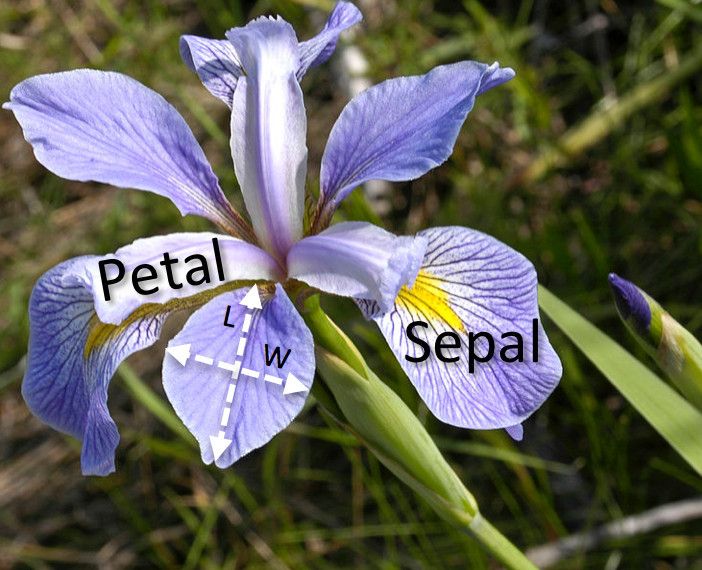

```{r,setup, include=FALSE}
knitr::opts_chunk$set(cache=TRUE, message = FALSE, echo=FALSE)
knitr::opts_chunk$set(fig.align = "center", fig.width = 6, fig.height = 4)
options(knitr.table.format = "html")
options(kableExtra.latex.load_packages = FALSE)

library(tidyverse)
library(kableExtra)

add_theme <- function()
  theme_bw()+
  theme(
    axis.text = element_text(family="Helvetica", face = "bold", size = 10),
    axis.title = element_text(family="Helvetica", face = "bold", size = 12),
    strip.text = element_text(family="Helvetica", face = "bold", size = 12),
    title = element_text(family="Helvetica", face = "bold", size = 14),
    legend.position = "bottom",
    legend.text = element_text(family="Helvetica", face = "bold", size = 12)
  )
```

[**Download pdf**](inference-part1.pdf)

## The subject of statistics.

### What is statistics?

_**Statistics**_ is a study of the 

- collection, 
- analysis, 
- interpretation, 
- presentation,
- organization 

of data.

The _**aim of statistics**_ is to give  an  information about a population based on a sample from this population.

### Population

A _**population**_ is a complete set of items that share at least one property and have features that are of interest. For instance,

- all persons living in a country have _**weight**_, _**height**_, _**age**_, _**salary**_, etc.
- biological species that live in the same region at the same time and have unique attributes such as _**growth rate**_, _**age structure**_, _**sex ratio**_, _**mortality rate**_.

### Sample

A _**sample**_ is a subset of population items collected and/or selected _**by a defined procedure**_. Elements of a sample are known as _**sample points**_, _**sampling units**_ or _**observations**_.

_**Sampling**_ is a procedure of data selection from a population. Having a sample from a population, one can solve two types of _**statistical problems**_:

### Statistcal problems

- a _**problem of descriptive statistics**_ -– _summarizing_ and _describing_ a data sample in order to get an information about a population (e.g., _**sample mean**_, _**sample variance**_, _**minimum**_ (_**maximum**_) _**sample value**_, etc.);
- a _**problem of inferential statistics**_ -– making an inference about population properties. This includes _**hypotheses testing**_ and _**deriving estimates**_.

Making an inference about any population by analysing a sample can cause errors. 

\begin{equation*}
  \varepsilon = X_{\text{true}} - X_{\text{observed}}.
\end{equation*}

There are two types of errors:

- a _**random error**_.
- a _**systematic error**_ or a _**bias**_.

### Random error.

_**Random error**_ is also known as _**variability**_, _**random variation**_, or ``_**noise in a system**_''.

Random error has no _preferred direction_, so we expect that averaging over a large number of observations will yield an _**error effect of zero**_. 

In this case, an estimate _**may be imprecise**_, but _**not inaccurate**_. The impact of a random error, _**imprecision**_, can be minimized with a large sample sizes.

```{r random-error: measurements, echo=FALSE, warning=FALSE, fig.width=8, preview=TRUE}
obs <- tibble(
  obs_no = seq_len(100),
  obs_value = rnorm(100, mean = 1, sd = 1.5)
) %>% 
  mutate(obs_mean = cumsum(obs_value)/obs_no)
  

ggplot()+
  geom_point(data = obs, aes(x = obs_no, y = obs_value), color = "red", size = 3)+
    geom_line(aes(x=c(0,101),y=rep(1,2)), size = 1.2)+
    scale_x_continuous(breaks = seq(5, 100, by = 5))+
    scale_y_continuous(limits = c(-4, 6), breaks = c(1))+
    xlab("A measurement's number")+
    ylab("A value measured")+
    add_theme()
```

At this plot, black solid line repersents a _**true**_ value of some parameter, and red dots are observed parameter values. 

```{r random-error: averaging, echo=FALSE, warning=FALSE, fig.width=8}

ggplot()+
  geom_line(data = obs, aes(x = obs_no, y = obs_mean, color = "average"), size = 3)+
  geom_line(aes(x=c(0,101),y=rep(1,2), color = "true"), size = 1.2)+
  scale_x_continuous(breaks = seq(5, 100, by = 5))+
  scale_y_continuous(limits = c(-4, 6), breaks = c(1))+
  xlab("The number of measurements")+
  ylab("Averaged measurements")+
  scale_color_manual(values = c("average"="red", "true"="black"), name = "")+
  add_theme()
```

Here we can see that the average of values observed approaches a true parameter value with the number of measurements increases.

_**Random error**_ corresponds to _**imprecision**_.

### Systematic Error (Bias).

_**Systematic error**_ (_**bias**_) refers to deviations that are not due to chance alone. _**Bias**_ has a net direction and magnitude so that averaging over a large number of observations does not eliminate its effect. 

In fact, _**bias**_ can be large enough to invalidate any conclusions. Increasing the sample size is not going to help. 

The simplest example occurs with a measuring device that is improperly calibrated so that it consistently overestimates (or underestimates) the measurements.

```{r systematic error: measurements, echo=FALSE, warning=FALSE, fig.width=8}
obs <- tibble(
  obs_no = seq_len(100),
  obs_value = rnorm(100, mean = 2.5, sd = 1.5)
) %>% 
  mutate(obs_mean = cumsum(obs_value)/obs_no)
  

ggplot()+
  geom_point(data = obs, aes(x = obs_no, y = obs_value), color = "red", size = 3)+
    geom_line(aes(x=c(0,101),y=rep(1,2)), size = 1.2)+
    scale_x_continuous(breaks = seq(5, 100, by = 5))+
    scale_y_continuous(limits = c(-2.5, 7.5), breaks = c(1))+
    xlab("A measurement's number")+
    ylab("A value measured")+
    add_theme()
```

At this plot, black solid line reprsents a _**true**_ value of some parameter, and red dots are observed parameter values. 

```{r systematic-error: averaging, echo=FALSE, warning=FALSE, fig.width=8}
ggplot()+
  geom_line(data = obs, aes(x = obs_no, y = obs_mean, color = "average"), size = 3)+
  geom_line(aes(x=c(0,101),y=rep(1,2), color = "true"), size = 1.2)+
  scale_x_continuous(breaks = seq(5, 100, by = 5))+
  scale_y_continuous(limits = c(-2.5, 7.5), breaks = c(1))+
  xlab("The number of measurements")+
  ylab("Averaged measurements")+
  scale_color_manual(values = c("average"="red", "true"="black"), name = "")+
  add_theme()
```

Here we see that the average of values observed is far away from a true parameter value for any sample size value.

_**Systematic error**_ (_**bias**_) corresponds to _**inaccuracy**_.

### Example of a bias. 

The presidential election of 1936 pitted Alfred Landon, the Republican governor of Kansas, against the incumbent President, Franklin D. Roosevelt. The year
1936 marked the end of the _**Great Depression**_, and economic issues such as unemployment and government spending were the dominant themes of the campaign.
The _Literary Digest_ was one of the most respected magazines of the time and had a history of accurately predicting the winners of presidential elections
that dated back to 1916. For the 1936 election, the Literary Digest prediction was that Landon would get 57\% of the vote against Roosevelt’s 43\% (these are
the statistics that the poll measured). The actual results of the election were 62\% for Roosevelt against 38\% for Landon (these were the parameters the
poll was trying to measure). The sampling error in the Literary Digest poll was a whopping 19%, the largest ever in a major
public opinion poll. Practically all of the sampling error was the result of sample bias.

The irony of the situation was that the _Literary Digest_ poll was also one of the largest and most expensive polls ever conducted, with a _**sample size of around 2,4 million people**_! At the same time, the _Literary Digest_ was making its fateful mistake, _George Gallup_ was able to predict a victory for Roosevelt using a _**much smaller sample of about 50,000 people**_.

This illustrates the fact that bad sampling methods cannot be cured by increasing a sample size, which in fact just compounds the mistakes. There were two
basic causes of the _Literary Digest_'s downfall: 

- _**selection bias**_.
- _**nonresponse bias**_.

_**The first major problem**_ with the poll was in the selection process for the names on the mailing list, which were taken from 

- telephone directories, 
- club membership lists, 
- lists of magazine subscibers, 
- etc. 

Such a list is guaranteed to be slanted _**toward middle- and upper-class voters**_, and by default to _**exclude lower-income voters**_. One must remember that in 1936, telephones were much more of a luxury than they are today. Furthermore, at a time when there were still 9 million people unemployed, the names of a significant segment of the population would not show up on lists of club memberships and magazine subscribers. At least with regard to economic status, the _Literary Digest_'s mailing list was far from being a representative cross-seciton of the population. 

**This sort of sample bias is called** _**selection bias**_.

_**The second problem**_ with the _Literary Digest_'s poll was that out of the 10 million people whose names were on the original mailing list, only about 2.4 million responded to the survey. Thus, the size of the sample was about one-fourth of what was originally intended. People who respond to surveys are different from people who don’t, not only in the obvious way (their attitude toward surveys) but also in more subtle and significant ways. When the response rate is low (as it was in this case, 0.24), a survey is said to suffer from _**nonresponse bias**_.

Two morals of the story:

- A badly chosen big sample is much worse than a well-chosen small sample.
- Watch out for _**selection bias**_ and _**non-response bias**_.

## Data description.

Here, we show how to describe observed data using `Iris` dataset.

### Iris dataset

`iris` is a dataset from `R` package `datasets`. It contains the following information 

- Sepal length (cm)
- Sepal width (cm)
- Petal length (cm)
- Petal width (cm)
- Class:
    + Iris Setosa
    + Iris Versicolour
    + Virginica

```{r iris, fig.align='center', out.width='50%'}

```

Let us analyze a _sepal length_ of the _iris setosa_:

```{r get-iris-data, echo=TRUE,cache=TRUE,warning=FALSE}
library(magrittr)                       # loading a "pipe" operator
iris_setosa <- datasets::iris %>% 
  tibble::as_tibble() %>%               # converting data.frame to tibble
  dplyr::filter(Species == 'setosa')    # filtering -- keeping only iris setosa data

x <- iris_setosa$Sepal.Length           # extract sepal length of iris setosa
x
```

### Range of the observations

_**Range**_ of a sample: $\small{ [\min\limits_i{x_i}, \max\limits_i{x_i}]}$

```{r range1, echo=TRUE, cache=TRUE}
## 1st approach (good if there is no software available) 
# First, sort data points: 
x_sorted <- sort(x)
cat(x_sorted)

# Second, take the first and the last values from the data sorted:
range_x <- c(x_sorted[1], x_sorted[length(x_sorted)])
cat(range_x)
```

```{r range 2,echo=TRUE,cache=TRUE}
## 2nd approach (once one has R in hands the life is getting easier :) ) 
# Use built-in function range
range_x <- range(x)
cat(range_x)
```

### Mode

_**Mode**_ -- _the most frequent value in a sample_

```{r frequencies,echo = TRUE, cache=TRUE}
# creating a table of frequencies
frequency_table <- tibble::tibble(value = x) %>% 
  dplyr::group_by(value) %>% 
  dplyr::summarise(frequency = n()) 
print(frequency_table)
```

```{r mode-table,echo = TRUE, cache=TRUE}
# calculating Mode: create a table of values with the highest frequency
mode_table <- dplyr::filter(frequency_table, frequency == max(frequency)) 
print(mode_table)
```

```{r compute-mode,echo = TRUE, cache=TRUE}
# calculating Mode: extract the values from a table as a number (or a vector)
mode_x <- mode_table$value
cat(mode_x)
```

### Median

_**Median**_ -- _a number which separates a sample into two euqal parts_.

```{r compute-median, echo=TRUE, cache=TRUE}
median_x <- median(x)
cat(median(x))
```

### Quantiles

_**Quantiles**_ -- _cutpoints which divide a set of observations into equally sized groups_.

$\boldsymbol{q}$-_**quantiles**_ -- _values that partition a finite set of values into $q$ subsets of equal sizes. There are $q-1$ of the $q$-quantiles_.

- the only 2-quantile is called the _**median**_.
- the 3-quantiles are called _**tertiles**_ or _**terciles**_. 
- the 4-quantiles are called _**quartiles**_.

```{r 2-quantiles,echo=TRUE,cache=TRUE}
quantile2_x <- quantile(x, probs = 1/2)
cat(quantile2_x)
```

```{r 3-quantiles,echo=TRUE,cache=TRUE}
quantile3_x <- quantile(x, probs = c(1/3, 2/3))
cat(quantile3_x)
```

```{r 4-quantiles,echo=TRUE,cache=TRUE}
quantile4_x <- quantile(x, probs = c(1/4, 1/2, 3/4))
cat(quantile4_x)
```

### Sample mean

_**Sample mean**_ -- _a sum of all sample points divided by a number of data points (**sample size**)_

$$\overline{X} = \frac{x_1 + x_2 + \ldots + x_n}{n}$$

```{r compute-mean,echo=TRUE, cache=TRUE}
mean_x <- mean(x)
cat(mean_x)
```

The _**mean**_ is the ``_**average**_'' value.

### Sample variance and sample standard deviation

_**Sample variance**_ ($s^2$) and _**sample standard deviation**_ ($s$) are defined as

$$s^2 = \frac{(x_1-\overline{X})^2 + (x_2-\overline{X})^2 + \ldots + (x_n-\overline{X})^2}{n-1}, \quad s = \sqrt{s^2}$$

```{r compute-var,echo=TRUE, cache=TRUE}
sample_var <- var(x)
cat(sample_var)
```

```{r compute-sd,echo=TRUE, cache=TRUE}
sample_sd <- sd(x)
cat(sample_sd)
```

- if $s$ is high ($s \uparrow$) then there is more spreading.
- if $s$ is low ($s \downarrow$) then there is less spreading. 

## Statistical plots.

Visualizing the data helps to understand how it is distributed. 

### Histogram

One way of visualization is plotting a ***histogram***. 

_**Histogram**_ is a bar chart that shows how many data (sample) points are within a range (an interval), called a bin.The height of the bar indicates the number of observations (_**frequency**_) in that interval. 

_**Histogram**_ is an _approximation of a probability density function (p.d.f.)_.

```{r frequency-table, echo = TRUE, cache=TRUE}
# number of bins
n_intervals <- 5 

# break points (interval endpoints)
breaks <- seq(min(x), max(x), length = n_intervals+1) 

# create a histogram object
histogram <- hist(x, breaks, plot = FALSE) 

# get frequencies
frequencies <- histogram$counts

# create frequency table 
frequency_table <- tibble(
  no = seq_along(frequencies),
  interval = sprintf("[% 4.2f, % 4.2f]", breaks[no], breaks[no+1]),
  frequency = frequencies
)

print(frequency_table)
```

```{r histogram-plot, fig.width=8}
ggplot()+
  geom_histogram(aes(x), breaks = breaks, 
                 color = "black", 
                 fill = "white")+
  scale_x_continuous(breaks = breaks)+
  scale_y_continuous(breaks = frequencies)+
  xlab("x")+
  ylab("Frequency")+
  ggtitle("Histogram of x")+
  add_theme()
```

### Cumulative plot

Another graph that is useful is the _**cumulative plot**_. It represents the frequency of occurrence of values of a studied parameter less than a reference value.

It is an _approximation of a cumulative distribution function (c.d.f.)_.

```{r cumulative table, echo=TRUE}
# number of bins
n_intervals <- 5 

# break points (interval endpoints)
breaks <- seq(min(x), max(x), length = n_intervals+1) 

# create a histogram object
histogram <- hist(x, breaks, plot = FALSE) 

# get frequencies
frequencies <- histogram$counts

# create cumulative table 
cumulative_table <- tibble(
  breaks = breaks,
  `cumulative frequency` = cumsum(c(0, frequencies))
)

print(cumulative_table)
```

```{r cumulative-plot, fig.width=8}
cumulative_table %>% 
    ggplot(aes(x = breaks, y = `cumulative frequency`))+
      geom_line()+
      geom_point()+
      scale_x_continuous(breaks = breaks)+
      scale_y_continuous(breaks = cumsum(c(0, frequencies)))+
      xlab("x")+
      ylab("Cumulative frequency")+
      ggtitle("Cumulative plot of x")+
      add_theme()
```

### Standard deviation and data spreading

The following plots show the influence of a standard deviation ($\sigma$) on the data spreading. The less the $\sigma$ value the more data are concentrated around the data mean, and _vise versa_. 

```{r sigma-influence, echo=FALSE, fig.width=8}
tibble(
  `sigma = 0.5` = rnorm(10000, mean = 0, sd = 0.5), 
  `sigma = 1.0` = rnorm(10000, mean = 0, sd = 1.0), 
  `sigma = 1.5` = rnorm(10000, mean = 0, sd = 1.5)
) %>% 
  gather(sigma, value) %>% 
  ggplot()+
  geom_histogram(aes(x=value), color = "black", fill = "white", bins = 50) +
  ylab("Frequency")+
  facet_grid(. ~ sigma)+
  add_theme()
```

## Estimation

- In real life experiments, we deal with observed data. 
- The values we get from the data are the _**values of some random variable (discrete or continuous), which follows some distribution**_.
- The distribution has parameters (_**parameters of the distribution**_) but we don't really know exact values of the parameters.
- All we can do is just the _**estimation**_.

There are two types of estimation:

- _**point estimation**_.
- _**interval estimation**_.

## Point estimation

- Assume that we deal with a random variable $X$ that characterizes a population. 
- Then, $n$ sample points (observations) $x_1, x_2, \ldots, x_n$ of $X$ represent a sample (of a size $n$) from the population.

### Maximum likelihood estimation (MLE)

Given a set of observations taken from some distribution $p(x|\boldsymbol{\theta})$, where $\boldsymbol{\theta}$ is an (vector of) unknown parameter(s), one considres a function

$$
\mathcal{L}(x_1, x_2, \ldots, x_n|\boldsymbol{\theta}) = \prod_{i = 1}^n{p(x_i|\boldsymbol{\theta})}
$$

known as a _**likelihood function**_. 

Also, a _**$\log$-likelihood function**_ can be considered:

$$
  \ell(x_1, x_2, \ldots, x_n|\boldsymbol{\theta}) = \log\mathcal{L}(x_1, x_2, \ldots, x_n|\boldsymbol{\theta}) = \sum_{i = 1}^n{\log p(x_i|\boldsymbol{\theta})}.
$$
The optimal value of $\boldsymbol{theta}$ is found as a solution to the optimazition problem

$$
  \widehat{\boldsymbol{\theta}} = \arg\max_{\boldsymbol{\theta}}\ell(x_1, x_2, \ldots, x_n|\boldsymbol{\theta}).
$$

### Examples of MLEs

_**Example 1**_ (Normal distribution)

Assume that we have a sample from a normal distribution:

$$
  x_1, x_2, \ldots, x_n \sim N(\mu, \sigma^2).
$$
Parameters of the distribution are

$$
  \boldsymbol{\theta} = (\mu, \sigma),
$$
and they are _**unknown**_.

Let us write down a _**likelihood function**_:

$$
\begin{aligned}
  \ell(x_1, x_2, \ldots, x_n|\mu, \sigma) &= \sum_{i = 1}^n{\log\left(\frac{1}{\sigma\sqrt{2\pi}}e^{-\frac{(x_i-\mu)^2}{2\sigma^2}}\right)} = \\
  &= -\frac{n}{2}\log(2\pi)-n\log(\sigma)-\frac{1}{2}\sum_{i = 1}^{n}\frac{(x_i-\mu)^2}{\sigma^2}.
\end{aligned}
$$
By solving the corresponding optimization problem, we obtain

$$
  \begin{aligned}
    \widehat{\mu} &= \frac{1}{n}\sum_{i = 1}^nx_i = \overline{X}\\
    \widehat{\sigma}^2 &= \frac{1}{n}\sum_{i = 1}^n\left(x_i-\overline{X}\right)^2
  \end{aligned}
$$
which are the sample mean and sample variance respectively.

_**Example 2**_ (Exponential distribution)

Assume that we have a sample from an exponential distribution:

$$
  x_1, x_2, \ldots, x_n \sim Exp(\lambda).
$$

Parameter 

$$
  \boldsymbol{\theta} = \lambda
$$

of the distribution is _**unknown**_.

The _**likelihood function**_ in this case is

$$
\begin{aligned}
  \ell(x_1, x_2, \ldots, x_n|\lambda) &= \sum_{i = 1}^n{\log\left(\lambda e^{-\lambda x_i}\right)} = \\
  &= n\log(\lambda)-\lambda\sum_{i = 1}^{n}x_i.
\end{aligned}
$$

By solving the corresponding optimization problem, we obtain

$$
  \begin{aligned}
    \widehat{\lambda} &= \frac{n}{\sum_{i = 1}^nx_i} = \frac{1}{\overline{X}}.
  \end{aligned}
$$
_**Example 3**_ (Binomial distribution)

Let

$$
  x_1, x_2, \ldots, x_n \sim Bin(m, p).
$$

be a sample from the binomial distribution. An _**unknown parameter**_ is

$$
  \boldsymbol{\theta} = p.
$$
In this case, the _**likelihood function**_ is

$$
\begin{aligned}
  \ell(x_1, x_2, \ldots, x_n|p) &= \sum_{i = 1}^n{\log\left({m\choose{x_i}}p^{x_i}(1-p)^{m-x_i}\right)} = \\
  &= n\log{m\choose{x_i}} + \log(p)\sum_{i = 1}^{n}x_i + \log(1-p)\sum_{i = 1}^n{(m - x_i)}.
\end{aligned}
$$
By solving the corresponding optimization problem, we obtain

$$
  \begin{aligned}
    \widehat{p} &= \frac{\overline{X}}{m}.
  \end{aligned}
$$
### Estimator and estimation 

Two important quantities are

$$	
\begin{array}{ll} 
  \mathbf{\text{sample mean}}  & \\
  & \overline{X} = \frac{1}{n}\sum\limits_{i = 1}^{n}{x_i}. \\
	\mathbf{\text{sample variance}}  \\ 
	 & s^2 = \frac{1}{n-1}\sum\limits_{i = 1}^{n}{\left(x_i-\overline{X}\right)^2}.
\end{array}
$$
(!!! Notice that division is by $n-1$)

These estimations are two _**point estimations**_.

In general, an _**estimator**_ of some parameter $\theta$ (that is parameter of the population) is a function 

$$
  \widehat{\theta} = \widehat{\theta}(X_1, X_2, \ldots, X_n)
$$ 

of sample points.

An _**estimation**_ is an observation of the _**estimator**_ 

$$
  \widehat{\theta}(x_1, x_2, \ldots, x_n).
$$
A point estimation is called _**unbiased**_ if 

$$
  \mathbf{E}[{\widehat{\theta}(X_1, X_2, \ldots, X_n)}] = \theta.
$$

That is, the expected value is equal to the quantity to be estimated.

_**Example 1**_.

$\frac{1}{n}\left(X_1 + X_2 + \ldots + X_n\right)$ is an _**unbiased**_ estimation of the mean ($\mu$):

$$
\begin{aligned}
  \mathbf{E}\left[\frac{1}{n}\left(X_1 + X_2 + \ldots + X_n\right)\right] &= \\
  &= \frac{1}{n}\left(\mathbf{E}[X_1] + \mathbf{E}[X_2] + \ldots + \mathbf{E}[X_n]\right) = \\
  &= \left|\mathbf{E}[X_i] = \mu,\text{ for all }i\right| = \\
  &= \frac{1}{n}\cdot n\cdot\mu = \mu
\end{aligned}
$$
_**Example 2**_.

$\frac{1}{n}\left((X_1-\overline{X})^2 + (X_2-\overline{X})^2 + \ldots + (X_n-\overline{X})^2\right)$ is a _**biased**_ estimation of the variance;

$$
\begin{aligned}
  \mathbf{E}\left[\frac{1}{n}\left((X_1-\overline{X})^2 + (X_2-\overline{X})^2 + \ldots + (X_n-\overline{X})^2\right)\right] &= \frac{n-1}{n}\sigma^2
\end{aligned}
$$

_**Example 3**_.

$\frac{1}{n-1}\left((X_1-\overline{X})^2 + (X_2-\overline{X})^2 + \ldots + (X_n-\overline{X})^2\right)$ is an _**unbiased**_ estimation of the variance.

$$
\begin{aligned}
  &\mathbf{E}\left[\frac{1}{n-1}\left((X_1-\overline{X})^2 + (X_2-\overline{X})^2 + \ldots + (X_n-\overline{X})^2\right)\right] = \\
  \frac{n}{n-1}&\mathbf{E}\left[\frac{1}{n}\left((X_1-\overline{X})^2 + (X_2-\overline{X})^2 + \ldots + (X_n-\overline{X})^2\right)\right] = \\
  \frac{n}{n-1}&\frac{n-1}{n}\sigma^2 = \sigma^2.
\end{aligned}
$$

## Confidence interval

- Points estimation doesn't tell us _**how much error it produces**_. 
- _**Interval estimations**_, on the other hand, provide us with such information.

_**Confidence interval**_ gives the lower and the upper bounds of an estimated parameter $\theta$ as well as the probability of this parameter belongs to these bounds. 

This probability is called a _**confidence probability**_.


### Confidence interval for the mean (when variance is known). 

Let $\overline{X}$ be a sample mean of a sample of size $n$. And suppose that the population variance is known and equals to $\sigma^2$. What is the confidence interval of the population mean $\mu$? 

Let us introduce a new random variable: 

$$
  Z = \frac{\overline{X} - \mu}{\frac{\sigma}{\sqrt{n}}} \sim N(0, 1).
$$

Now, let us find two values $z_{\frac{\alpha}{2}}$, $z_{1-\frac{\alpha}{2}}$ such that

$$
  \text{Pr}\left({z_{\frac{\alpha}{2}} \leq Z \leq z_{1-\frac{\alpha}{2}}}\right) = \gamma = 1-\alpha, 
$$

where $\gamma$ is the _**confidence probability**_, and $\alpha$ is the _**significance level**_. 

$$
\begin{aligned}
\text{Pr}\left({z_{\frac{\alpha}{2}} \leq Z \leq z_{1-\frac{\alpha}{2}}}\right) &= F\left(z_{1-\frac{\alpha}{2}}\right) - F\left(z_{\frac{\alpha}{2}}\right) = \gamma \Leftrightarrow \\ 
&\left\{
  \begin{array}{c}
  \begin{aligned}
    F\left(z_{1-\frac{\alpha}{2}}\right) &= 1-\frac{\alpha}{2} \\
    F\left(z_{\frac{\alpha}{2}}\right) &= \frac{\alpha}{2} 
  \end{aligned}  
  \end{array}
\right.
\end{aligned}
$$ 

Here, $F(x)$ is the probability distribution function of the random variable $Z \sim N(0, 1)$. $z_{1-\frac{\alpha}{2}}$ and $z_{\frac{\alpha}{2}}$ are quantiles of the normal distribution, given probabilities $1-\frac{\alpha}{2}$, $\frac{\alpha}{2}$: 

$$
\left\{
  \begin{array}{c}
  \begin{aligned}
    z_{1-\frac{\alpha}{2}} &= F^{-1}\left(1-\frac{\alpha}{2}\right) \\
    z_{\frac{\alpha}{2}} &= F^{-1}\left(\frac{\alpha}{2}\right)
  \end{aligned}  
  \end{array}
\right.
$$

So, the confidence interval for the population mean is 

$$
  \overline{X} - z_{1-\frac{\alpha}{2}}\frac{\sigma}{\sqrt{n}} \leq \mu \leq \overline{X} - z_{\frac{\alpha}{2}}\frac{\sigma}{\sqrt{n}}.
$$

_**Example 4**_. Let $\overline{X} = 22$ be a sample mean of a sample of a size $n = 100$ taken from $N(\mu, \sigma^2 = 4)$. What is the 95\% confidence interval for the population mean $\mu$?

Here, we have $\gamma = 0.95 \Leftrightarrow \alpha = 1-\gamma = 0.05$. Then 

$$
\left\{\begin{aligned}
z_{1-\frac{\alpha}{2}} &= F^{-1}\left(\frac{1-\alpha}{2}\right) = F^{-1}(0.975) = 1.96 \\
z_{\frac{\alpha}{2}} &= F^{-1}\left(\frac{\alpha}{2}\right) = F^{-1}(0.025) = -1.96 \\
\end{aligned} 
\right.
$$ 
$$
  \overline{X} - z_{\frac{\alpha}{2}}\frac{\sigma}{\sqrt{n}} \leq \mu \leq \overline{X} + z_{\frac{\alpha}{2}}\frac{\sigma}{\sqrt{n}} \Leftrightarrow
$$ 

$$
22-1.96\frac{2}{\sqrt{100}} \leq \mu \leq 22+1.96\frac{2}{\sqrt{100}} \Leftrightarrow \mu \in [20.76039, 23.23961]
$$ 
with 95\% of the confidence.

### Confidence interval for the mean (when the variance is unknown). 

Let $\overline{X}$ be a sample mean of a sample of a size $n$, and let $s^2$ be a sample variance of this sample. What is the confidence interval of the population mean $\mu$? 

Let us introduce a new random variable 

$$
  T = \frac{\overline{X} - \mu}{\frac{s}{\sqrt{n}}}.
$$

$T$ follows $\boldsymbol{t}$ distribution or Student's distribution} with $n-1$ _**degrees of freedom**_, $T \sim t(n-1)$. 

Now, let us find two values $t_{\frac{\alpha}{2}}(n-1)$, $t_{1-\frac{\alpha}{2}}(n-1)$ such that 

$$
  \text{Pr}\left({t_{\frac{\alpha}{2}}(n-1) \leq T \leq t_{1-\frac{\alpha}{2}}}(n-1)\right) = \gamma = 1-\alpha, 
$$ 

where $\gamma$ is the confidence probability, and $\alpha$ is the significance level. 

$$
\begin{aligned}
\text{Pr}\left({t_{\frac{\alpha}{2}}(n-1) \leq T_n \leq t_{1-\frac{\alpha}{2}}}(n-1)\right) &= F\left(t_{1-\frac{\alpha}{2}}(n-1)\right) - F\left(t_{\frac{\alpha}{2}}(n-1)\right) = \gamma \Leftrightarrow \\ 
&\left\{
  \begin{array}{c}
  \begin{aligned}
    F\left(t_{1-\frac{\alpha}{2}}\right) &= 1-\frac{\alpha}{2} \\
    F\left(t_{\frac{\alpha}{2}}\right) &= \frac{\alpha}{2} 
  \end{aligned}  
  \end{array}
\right.
\end{aligned}
$$  

Here, $F(x)$ is the probability distribution function of the random variable $T \sim t(n-1)$. $t_{1-\frac{\alpha}{2}}(n-1)$ and $t_{\frac{\alpha}{2}}(n-1)$ are quantiles of $t$ distribution with $n-1$ degrees of freedom, given probabilities $1-\frac{\alpha}{2}$, $\frac{\alpha}{2}$: 

$$
\left\{
  \begin{array}{c}
  \begin{aligned}
    t_{1-\frac{\alpha}{2}}(n-1) &= F^{-1}\left(1-\frac{\alpha}{2}\right) \\
    t_{\frac{\alpha}{2}}(n-1) &= F^{-1}\left(\frac{\alpha}{2}\right)
  \end{aligned}  
  \end{array}
\right.
$$ 

So, the confidence interval for the population mean is 

$$
  \overline{X} - t_{1-\frac{\alpha}{2}}(n-1)\frac{s}{\sqrt{n}} \leq \mu \leq \overline{X} - t_{\frac{\alpha}{2}}(n-1)\frac{s}{\sqrt{n}}.
$$

